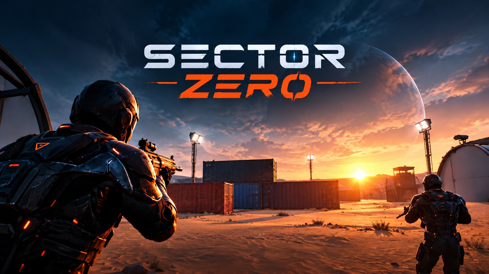
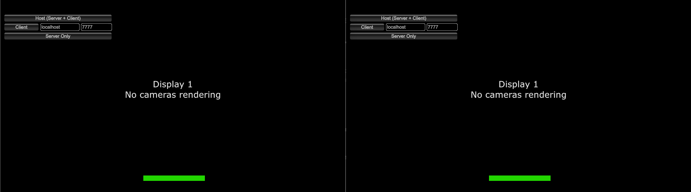
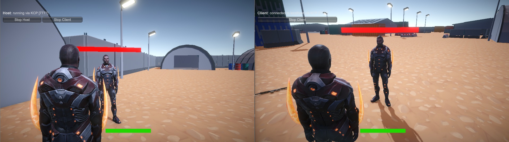
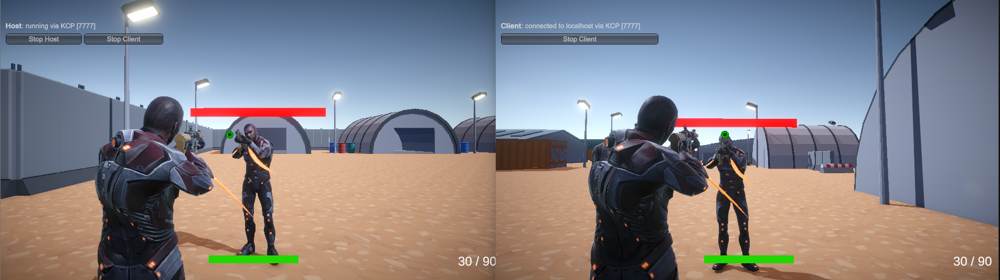
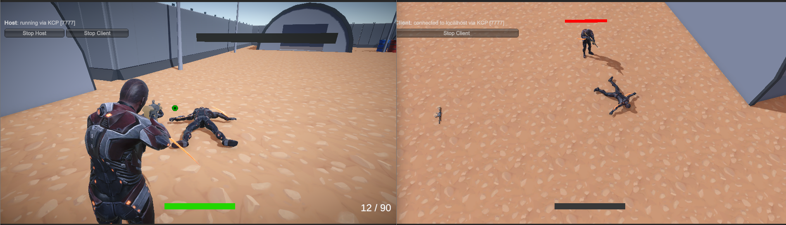
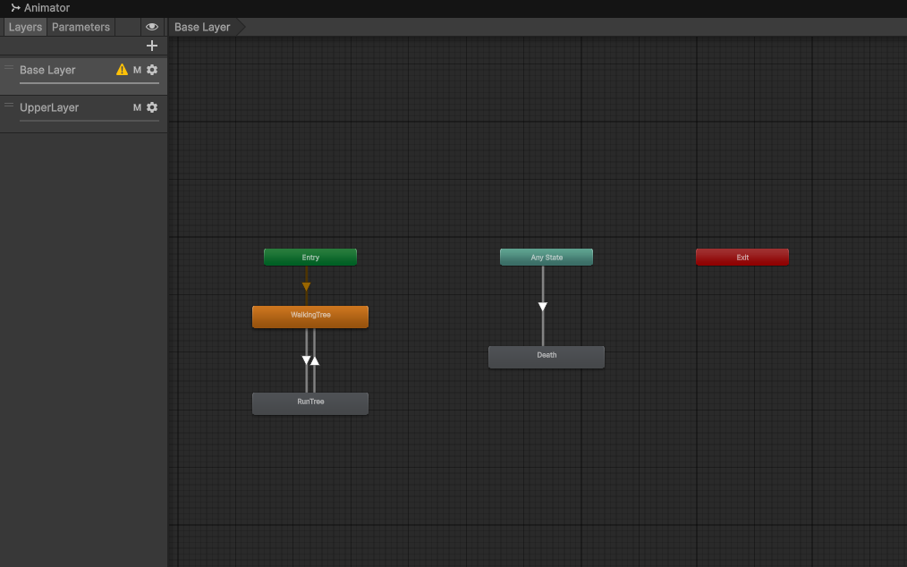

# 🎯 Sector Zero

<p align="center">
  
</p>

[](https://unity.com/)
[](https://github.com/MirrorNetworking/Mirror)
[](https://play.unity.com)
[](LICENSE)

A 3D multiplayer third-person shooter built with **Unity 6** and **Mirror**. Join a match as host or client, grab a weapon from the map, shoot other players and respawn when you go down. The project focuses on server-authoritative networking: movement, shooting, health, weapons and respawning are all handled over the network.

🎮 **[Open the Web Build (Unity Play)](https://play.unity.com/en/games/16eee0d9-0374-45f5-9720-179f539e90d9/sector-zero)**

> **Note:** The multiplayer uses KCP (UDP), which browsers do not support, so the web build cannot host or join a match. To play with others, run the project in the Unity Editor or a desktop build (see [Playing Multiplayer](#-playing-multiplayer)).

---

## 📸 Screenshots

*In-game screenshots (two game instances side by side: host on the left, client on the right):*

| Host / Client Menu | Two Players |
| :---: | :---: |
|  |  |

| Armed Players | Death and Respawn |
| :---: | :---: |
|  |  |

### Animator Setup



---

## ✨ Features

- **Multiplayer with Mirror:** Host (server + client), client or server-only start through Mirror's network HUD, with KCP transport.
- **Server-Authoritative Gameplay:** Movement and look input are sent to the server with `[Command]`s. Health, ammo and the equipped weapon are synchronized to everyone with `[SyncVar]`s.
- **Networked Bullet Pool:** Bullets are pooled instead of created and destroyed on every shot. Mirror's custom spawn handlers make the pooling work on clients too.
- **Weapon System:** Walk up to a weapon to pick it up and drop it with `G`. Automatic and semi-automatic fire, fire rate limit, magazine and reserve ammo, a 3-second reload and an empty-magazine click.
- **Crosshair and Ammo HUD:** The crosshair is placed on screen with a raycast from the weapon's muzzle, and the ammo counter turns red when the magazine is empty.
- **Health, Death and Respawn:** 100 health, 15 damage per bullet. When you die you drop your weapon, switch to a death camera and respawn at a spawn point after 5 seconds. Other players' health bars float above their heads.
- **Layered Animation:** A Humanoid rig with two animator layers (a base layer for movement and an upper-body layer for weapon animations). Spine and aim bones follow the camera pitch while holding a weapon.
- **Spatial Audio:** Shots, reloads, pickups, drops, hits, deaths and footsteps play at the position where they happen. Footsteps are triggered by animation events.
- **Modular Code:** The player controller is a `partial` class split into movement, weapon, damage, health bar and animation files.
- **Military Base Map:** A low-poly base with 5 spawn points and 5 weapons, plus a post-processing volume.

---

## 🕹️ Controls

| Action | Input |
| ------ | ----- |
| **Move** | `W` `A` `S` `D` |
| **Look** | Mouse |
| **Run** | `Left Shift` |
| **Fire** | Left mouse button |
| **Reload** | `R` |
| **Drop weapon** | `G` |
| **Pick up weapon** | Walk over it |

---

## 🌐 Playing Multiplayer

Host mode is the supported way to play.

1. Open `SampleScene` and press **Play** in the first Editor or build.
2. Click **Host (Server + Client)**.
3. In a second instance (a build, or a clone made with [ParrelSync](https://github.com/VeriorPies/ParrelSync)), keep the address as `localhost` and the port as `7777`, then click **Client**.
4. To play over a network, enter the host's IP address in the client and make sure UDP port `7777` is reachable.

The project was tested locally with two players. The network manager allows up to 10 connections and the map has 5 spawn points.

---

## ⚠️ Known Limitations

- **Web build:** KCP is UDP-based, so multiplayer does not work in the browser. A WebSocket transport and a public server would be needed.
- **Dedicated server:** The "Server Only" option is not supported. Some visual and state logic runs in `SyncVar` hooks, which only run on clients.
- **Network latency:** Movement and look input are sent to the server every frame, which can feel delayed on slow connections. Only local testing was done.
- **Missing features:** There is no reload animation, score or match flow, and no menu or pause screen.

---

## 🧩 Scripts

| Script | Purpose |
| ------ | ------- |
| `CharacterController` (Movement, Weapon, Damage, HealthBar, Animation) | Networked player split into partial classes |
| `Weapon` | Fire, reload, ammo, pick-up and drop logic |
| `Bullet` / `BulletPool` | Networked projectile and object pool |
| `InputManager` | Static input wrapper |
| `UIManager` | Health bar, crosshair and ammo text |
| `AudioManager` / `FootstepSFX` | Positional sound effects and music |

---

## 🛠️ Tech Stack & Assets

- **Engine:** Unity 6.4 (6000.4.3f1)
- **Language:** C#
- **Networking:** [Mirror](https://assetstore.unity.com/packages/tools/network/mirror-129321) with KCP Transport
- **Testing:** [ParrelSync](https://github.com/VeriorPies/ParrelSync) clones
- **Assets:**
  * Character and animations: [Mixamo](https://www.mixamo.com/), Ely By K. Atienza
  * Weapons: [Low Poly Weapons Vol. 1](https://assetstore.unity.com/packages/3d/props/guns/low-poly-weapons-vol-1-151980)
  * Map: [Military Base Pack](https://assetstore.unity.com/packages/3d/environments/military-base-pack-326310)
  * Music and sound effects: [Pixabay](https://pixabay.com/)

---

## 🚀 Getting Started (Local Setup)

1. **Clone the repository:**
```
   git clone https://github.com/emirsumer/SectorZero.git
```
2. **Open with Unity:** Add the folder in Unity Hub and use Unity 6000.4.3f1 (or a compatible Unity 6 version).
3. **Run the Game:** Open `SampleScene` and press **Play**, then follow [Playing Multiplayer](#-playing-multiplayer).

---

## 🙏 Credits

- The core networking setup was built together with my instructor; I developed the rest on top of it.
- 3D models and Mirror from the Unity Asset Store, character from Mixamo, sound from Pixabay.
- Cover art: AI-generated concept art.

## 📜 License

This project is open-source and available under the MIT License.
